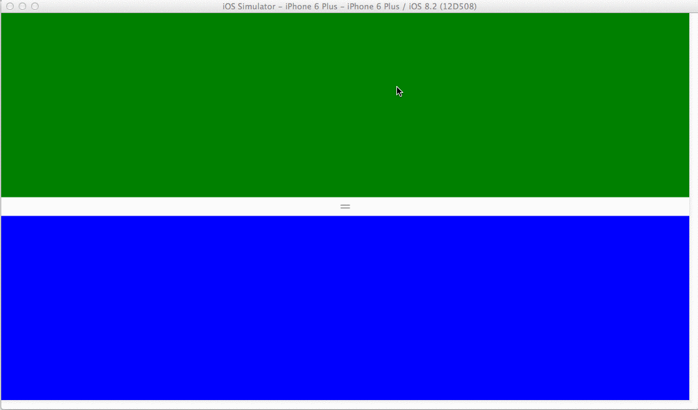
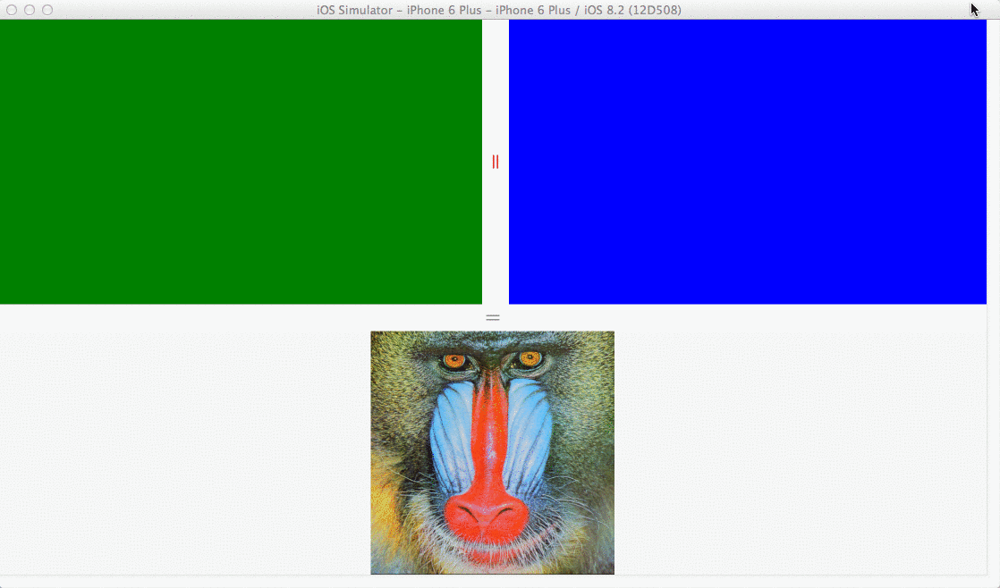

GridSplitter control for Xamarin Forms
===================

A control for <b>Xamarin Forms</b> that redistributes space between columns or rows of a <b>Grid</b> control.

Platforms supported: <b>iOS</b>, <b>Android</b>, <b>WinPhone</b>

Usage
-------

An example of a Grid with two rows and a GridSplitter control:

          <?xml version="1.0" encoding="UTF-8"?>
          <ContentPage xmlns="http://xamarin.com/schemas/2014/forms"
          	           xmlns:x="http://schemas.microsoft.com/winfx/2009/xaml"
          	           x:Class="GridSplitterApp.TestPage"
          	           xmlns:controls="clr-namespace:GridSplitterApp.Controls;assembly=GridSplitterApp">
          	<Grid RowSpacing="0">
          		<Grid.RowDefinitions>
          			<RowDefinition />
          			<RowDefinition Height="Auto" />
          			<RowDefinition />
          		</Grid.RowDefinitions>
          		<BoxView BackgroundColor="Green" />
          		<controls:GridSplitter Grid.Row="1"
          		                       VerticalOptions="Center" />
          		<BoxView BackgroundColor="Blue"
          			       Grid.Row="2" />
          	</Grid>
          </ContentPage>

Note that `<controls:GridSplitter Grid.Row="1" VerticalOptions="Center" />` tells the GridSplitter control it should resize the adjancent rows. 

And here's the result on iOS for the XAML above:

Also note the `RowSpacing=0` which resets the default spacing between the cells of Grid. You might want to set this on your Grid when using the GridSplitter, otherwise it won't look good.

If you would have to split two columns instead, you need to set `HorizontalOptions="Center"` on the GridSplitter:

          <?xml version="1.0" encoding="UTF-8"?>
          <ContentPage xmlns="http://xamarin.com/schemas/2014/forms"
          	           xmlns:x="http://schemas.microsoft.com/winfx/2009/xaml"
          	           x:Class="GridSplitterApp.TestPage"
          	           xmlns:controls="clr-namespace:GridSplitterApp.Controls;assembly=GridSplitterApp">
          	<Grid ColumnSpacing="0">
          		<Grid.ColumnDefinitions>
          			<ColumnDefinition />
          			<ColumnDefinition Width="Auto" />
          			<ColumnDefinition />
          		</Grid.ColumnDefinitions>
          		<BoxView BackgroundColor="Green" />
          		<controls:GridSplitter Grid.Column="1"
          		                       HorizontalOptions="Center" />
          		<BoxView BackgroundColor="Blue"
          			       Grid.Column="2" />
          	</Grid>
          </ContentPage>

Another example of two Grid controls each with their own GridSplitter:

The XAML for this layout is included in the sample app: [/GridSplitterApp/GridSplitterApp/MainPage.xaml)](/GridSplitterApp/GridSplitterApp/MainPage.xaml)
It also shows how you can easily change the style of the GridSplitter control.

Add GridSplitter to your project
-----------------------

1. Add GridSplitter control implementation to your Xamarin Forms PCL project:
       [/GridSplitterApp/GridSplitterApp/Controls/GridSplitter.cs](/GridSplitterApp/GridSplitterApp/Controls/GridSplitter.cs)

2. The control uses native renderes. You need to add the renderers to your Android and iOS project respectively:
       [/GridSplitterApp/GridSplitterApp.Droid/Renderers/GridSplitterRenderer.cs](/GridSplitterApp/GridSplitterApp.Droid/Renderers/GridSplitterRenderer.cs)
       [/GridSplitterApp/GridSplitterApp.iOS/Renderer/GridSplitterRenderer.cs](/GridSplitterApp/GridSplitterApp.iOS/Renderer/GridSplitterRenderer.cs)

Note you might need to update some namespaces in your app.
